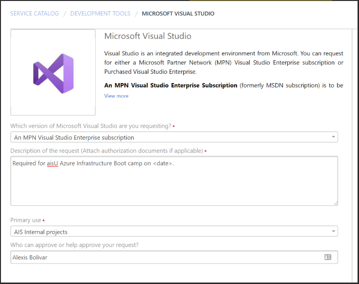

# Azure Infrastructure Bootcamp Pre-Reqs

## MPN Visual Studio Subscription

A Visual Studio Enterprise MPN subscription is required to attend the bootcamp. Furthermore:

- The MPN subscription needs to be issued by AIS (no client-issued or personal subscription).
- The MPN subscription needs to be attached to your @appliedis.com email. If you have a legacy MPN subscription attached to your personal email, request for a new one attached to your @appliedis.com email.  

Request your MSDN Subscription from the AIS service desk (https://help.appliedis.com). Allow up to a full week as your request first needs to be approved by a manager, and then it takes up to 48 hours for your Visual Studio Benefits to kick-in.

Please fill out the service desk request as follows (please select "An MPN Visual Studio Enterprise Subscription" from the first drop down):

Once you get your Visual Studio Enterprise MPN subscription, connect to your https://my.visualstudio.com/ and activate your $150 monthly Azure benefit.

You should be able to login to https://portal.azure.com with your @appliedis.com work account (not a live ID aliased by an appliedis account) and see an MSDN subscription within the appliedis.com directory:

## Coding Environment

You will need a coding environment to interact with Azure programmatically, edit and run scripts from the DevOps repo, and build the labs.

1. Install the tools below:
   - PowerShell Core https://github.com/PowerShell/PowerShell/releases
   - VS Code https://code.visualstudio.com/download
   - Git https://git-scm.com/download/win
   - VS Code PowerShell extension (install within VS Code under the "Extensions" tab)
   - PowerSHell AZ module (Install-Module -Name AZ from an elevated PowerShell session)

2. Verify you have access to the AISU Repo: https://appliedis.visualstudio.com/_git/AISU?path=%2FInfrastructureBootcamp. Request it if you don't

3. Connect your VSCode to the repo:
   - Select Git: Clone in the VSCode command palette.
   - Paste the URL to the repo https://appliedis.visualstudio.com/_git/AISU

Once this is complete you should see the repo in your VSCode:

## Additional Requirements for All Remote Bootcamps

The aisU All-Remote Bootcamps are performed exclusively through AIS' Microsoft Teams tenant. The training sessions are lead by instructors using Teams meetings with audio and video included in the experience.

**Bandwidth**
You need to attend from a connection with enough bandwidth to allow you to stream the classroom instruction in video and audio while also working on your Azure labs.
[NEEDS REVISION]

**Hardware Accessories**
You'll need a microphone and a camera setup to be used while attending the class.

**Other Recommendations**
- Lots of people like headphones. If you're one, get one that is very comfortable to wear and has a built in mic.
- You're going to want to have LOTS of screen space. Extra monitors and/or extra large screens help a lot
  [NEEDS REVISION]