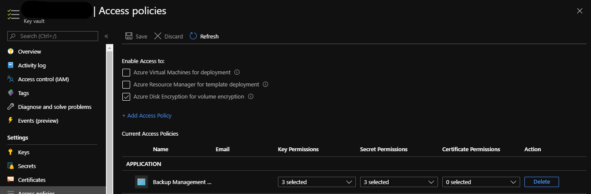

# **Scripts & Tools Used In Day 5 of Azure Infrastructure Bootcamp**

## **1. Deploy Key Vault**

```powershell
New-AzResourceGroupDeployment -TemplateFile .\keyVault_armTemplate.json -ResourceGroupName "AISU-E2-RG-AKV" -Name "<yourname>-E2-AKV-01" -keyVaultName "<yourname>-E2-AKV-01"
```

## **2. Deploy Log Analytics workspace**

```powershell
New-AzResourceGroupDeployment -TemplateFile .\logAnalyticsWorkspace_armTemplate.json -workspaceName "<yourname>-E-LOGWS1" -TemplateParameterFile .\parameters\FABIEN-E-LOGWS1.json -ResourceGroupName "AISU-E-RG-LOG"
```

## **3. Deploy Azure Automation Account (deploys Automation, creates RunAs account, uploads DSC modules, uploads and compiles a DSC configuration)**

* Edit automationAccount_buildAndConfig.ps1

```powershell
$deploymentParameter = @{

  "deploymentResourceGroup"="FABIEN-E-RG-AUTO"  <-----"AISU-E2-RG-AUTO"
  "AutomationAccountName"="FABIEN-E2-AUA"   <---------"<yourname>-E2-AUA"
  "AutomationAccountSku"="Free"}
```

* Run ps1 file

## **4. Create a temporary VM to onboard using Cloud Shell CLI**

**Note:** Run the command below to validate the subscription they are in

```azurecli
Az Account Show
```

**Note:** If a student has multiple subscriptions associated with their AIS account have them run:

```azurecli
az account set --subscription "ReplaceWithSubscriptionid"
```

```azuercli
    az vm create `
    --resource-group AISU-E2-RG-01 `
    --name myVM `
    --image win2016datacenter `
    --admin-username azureuser `
    --admin-password "2345@#$%wertWERT"
```

## **5.  Create a temporary Key Vault in the same RG and encrypt the VM disk**

```azurecli
az keyvault create --name "<yourname>myKV" --resource-group "AISU-E2-RG-01" --location eastus2 --enabled-for-disk-encryption
```

```azurecli
az vm encryption enable -g AISU-E2-RG-01 --name MyVM --disk-encryption-keyvault <yourname>myKV
```

```azurecli
az vm show --name MyVM -g "AISU-E2-RG-01"
```

* View Key Vault - secret for encrypted disk is type BEK

## **6. In the Portal**

* enable Diagnostic settings on the VM

* configure Advanced settings in Log Analytics
  * Windows Event Logs
  * Windows Performance Counters

* Add VM as a node in State Configuration (DSC) in Azure Automation and assign configuration

* Create a new Recovery Services Vault (Concept that we are trying to demonstrate is the Backup Management Service has the permissions needed to do a restore.)
  * Create Backup Policy
  * Add VM to Recovery Services Vault
  * Manually kick a backup off <BR>
  

* Delete temporary VM and associated VM resources, temporary Key Vault, and Recovery Services Vault

* Create Self-Signed SSL Cert (update access policy)
* Create Domain Join Secret
